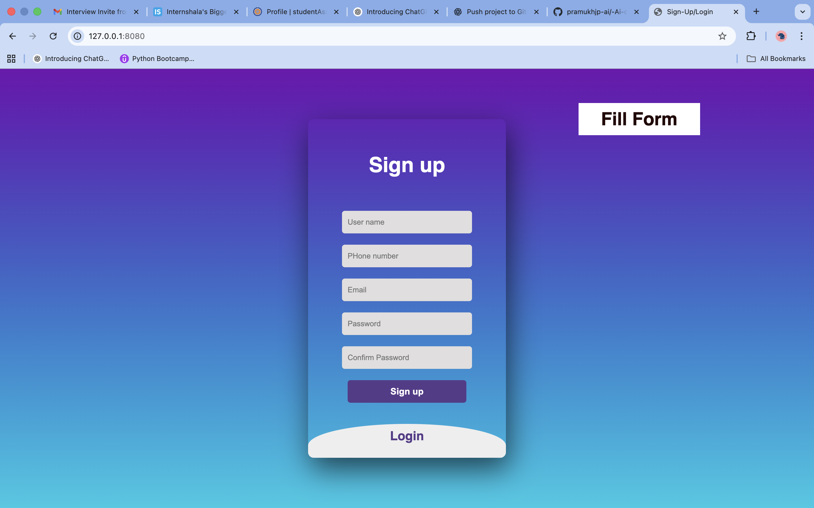
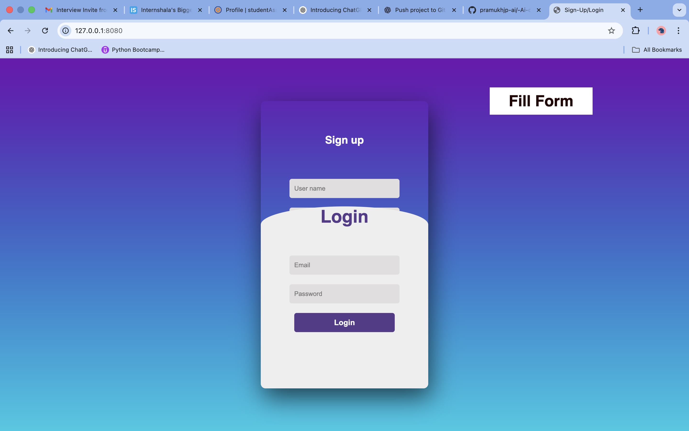
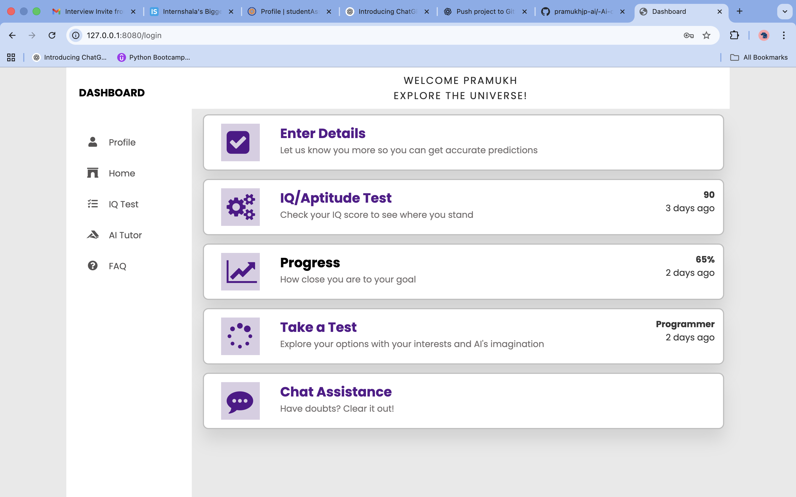
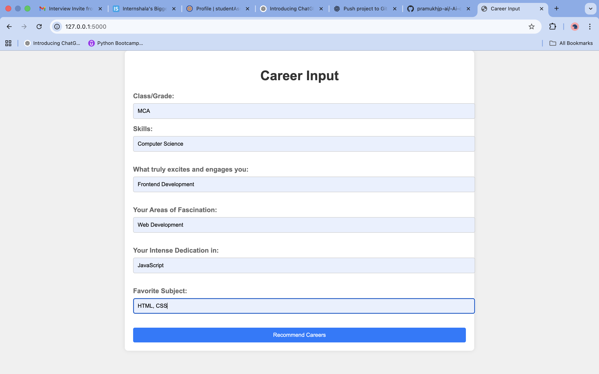
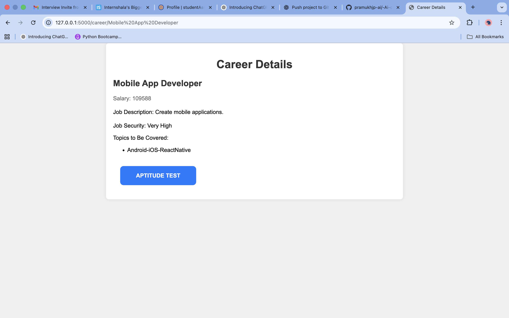
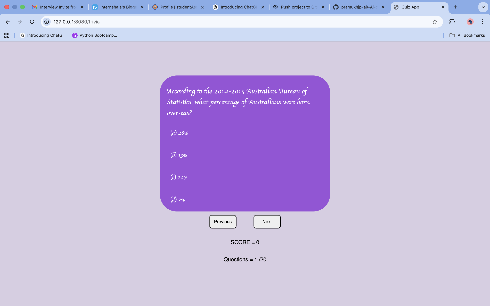
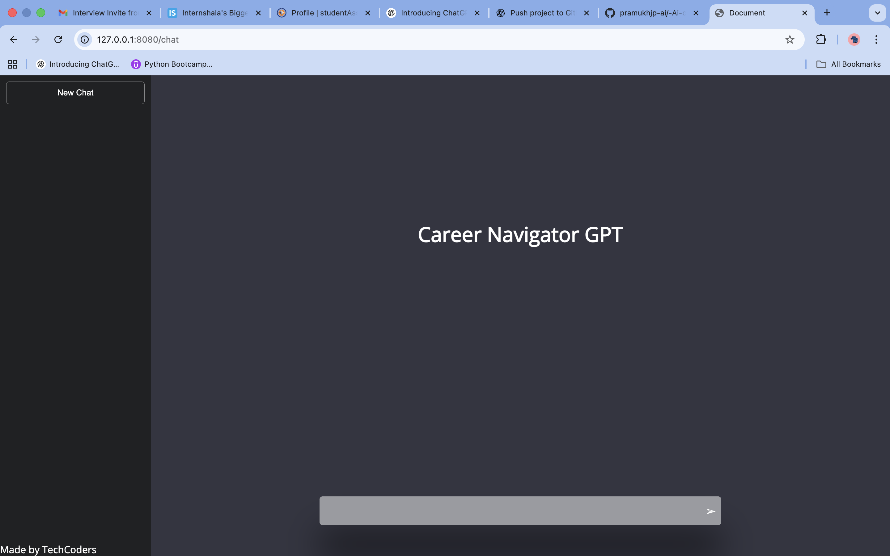
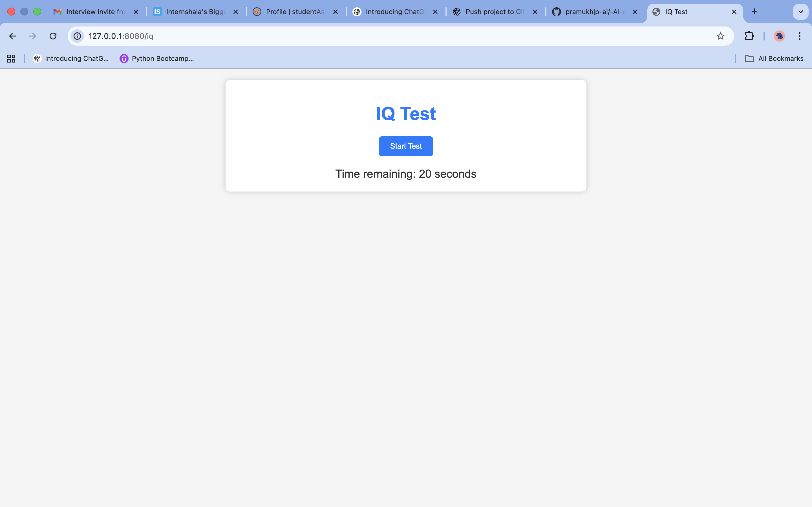
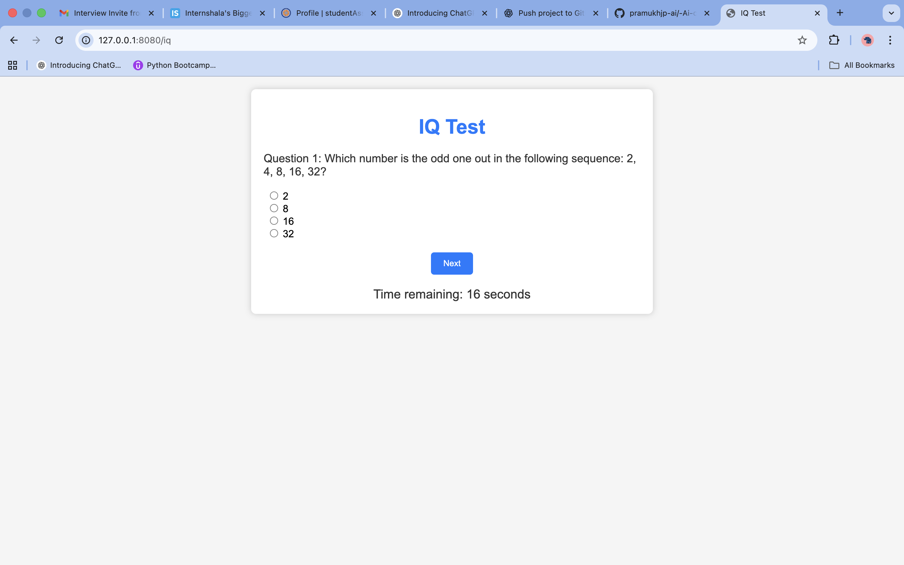

<h1>AI Career Navigator</h1>

A comprehensive AI-powered platform for career guidance, skill development, and resume optimization with integrated ATS analysis.

## 🚀 Quick Start

### Installation Requirements
- **Node.js:** 14.x or higher
- **Python:** 3.8 or higher
- **MongoDB:** 4.4 or higher
- **npm & pip:** Latest versions

### 1. Start Node.js Server (Port 8080)

```bash
cd Login
npm install                # First time only
npm run dev              # Development mode
# or
npm start                # Production mode
```

### 2. Start Python Server (Port 5000)

```bash
cd recommandation
pip install -r requirements.txt  # First time only
python app.py                     # Or: python -m flask run
```

### 3. Access the Application

- Main Application: `http://localhost:8080`
- Python API: `http://localhost:5000`

The problem statement we are working on is: "Making career choices and AI-based counseling accessible to every child at a secondary level along with aptitude tests and detailed career paths."

Our solution aims personalized recommendations, job descriptions, and salary insights to help students make informed decisions and optimize their educational pathways, using AI.

* The login/register page allows the user to create their own account. 

| Register | Login |
|---|---|
|  |  |

* The dashboard keeps track of the user's progress and also gives the user some additional options and features so that he can get a guided and defined path for his career.
  


* The users also have an option where they need to enter their career-related details, and based on those inputs and AI's suggestions, some recommended career options are given to the user with some follow-up questions to test their knowledge for the same.

| Prediction Window 1 | Prediction Window 2 |
|---|---|
|  |  |

* This is a trivia quiz and chatbot application that helps users test their knowledge on various topics and clear their doubts. 
* The Trivia questions allow the user to test their knowledge on various topics based on their given choices. This will enhance their idea of their own progress, as well as motivate them to work harder for their desired goal.

A chatbot has been added which is not fully functional yet, but its key features will be :
* Always Available: The chatbot is your round-the-clock career advisor, ready to chat with you day or night. It makes career exploration convenient for you.
* Instant Homework Help: AI-powered tutoring platforms act like 24/7 study partners. Whether it's math, science, or languages, they're there to give you quick help and explanations when you're stuck on assignments.

| Trivia | Chat-Bot |
|---|---|
|  |  |

* The IQ/Aptitude test will let the user know how much more they need to be prepared for various competitive exams as the IQ test is a very important part of those exams.

| IQ Test | IQ Test |
|---|---|
|  ||

---

## 📄 ATS Resume Builder

### Overview

The ATS Resume Builder is an intelligent resume creation and optimization tool that helps users create ATS (Applicant Tracking System) compatible resumes with powerful features:

- **Real-time ATS Scoring:** Get instant feedback on resume quality (0-100 scale)
- **Skill Autocomplete:** 100+ skills database with intelligent suggestions
- **Job Description Matching:** Compare resume against job descriptions with keyword matching analysis
- **PDF Export:** Download professionally formatted resumes
- **Multi-Resume Management:** Create and manage multiple resume versions
- **AI-Powered Analysis:** Formatting, keyword, and structure scoring

### Key Features

#### 1. Smart Resume Builder
- **Dynamic Form Interface:** Add multiple work experiences, education, and skills
- **Live Preview:** Real-time resume preview as you type
- **Personal Information:** Full contact details with validation
- **Work Experience:** Track job history with unlimited entries
- **Education:** Academic background and qualifications
- **Skills:** Auto-complete with 100+ technical and soft skills database
- **Certifications & Projects:** Additional achievements and portfolio
- **Job Description Input:** Optional field for keyword matching analysis

#### 2. ATS Analysis Engine
- **Formatting Score (0-25):** Email/phone validation, proper spacing, special character checks
- **Keyword Score (0-40):** Technical skills, frameworks, tools, and industry keywords detection
- **Structure Score (0-35):** Section completeness, organization, and content validation
- **Job Match Percentage:** Shows alignment with job description
- **Actionable Suggestions:** Specific recommendations for improvement
- **Missing Keywords:** Identifies skill gaps to add

#### 3. Resume Management
- **List View:** All resumes with scores and creation dates
- **Detail View:** Full formatted resume display
- **Edit Capability:** Update any section at any time
- **Bulk Operations:** Delete or manage multiple resumes
- **ATS Analysis:** Detailed scoring breakdown and suggestions
- **PDF Download:** Professional PDF export with formatting

### Getting Started

1. **Access Resume Builder**
   - From dashboard, click "ATS Resume Builder" card
   - Or navigate to `/resume/list`

2. **Create Your Resume**
   - Fill in personal information (required fields marked with *)
   - Add professional summary
   - Add work experience (with descriptions)
   - Add education
   - Add skills (use autocomplete for suggestions)
   - Optionally paste job description for keyword matching

3. **Review Results**
   - Live preview updates in real-time on right side
   - See current ATS score
   - Get improvement suggestions

4. **Manage Resumes**
   - View all your resumes in list
   - Edit any resume anytime
   - Analyze for ATS compatibility
   - Download as PDF

5. **Download Resume**
   - Click "Download PDF" button
   - Get professionally formatted document
   - Ready to submit to employers

### API Documentation

Complete API documentation available in [`API.md`](API.md):
- All REST endpoints with examples
- Request/response formats
- Error codes and handling
- Authentication requirements
- Rate limiting details

### Deployment Guide

Production deployment instructions in [`DEPLOYMENT.md`](DEPLOYMENT.md):
- Server setup and configuration
- Database migration
- Dependency installation
- Pre-deployment testing
- Monitoring and logging
- Rollback procedures

### Technology Stack

**Frontend:**
- EJS Template Engine
- HTML5 & CSS3
- Vanilla JavaScript (ES6+)
- Real-time DOM manipulation
- Responsive design

**Backend:**
- Node.js & Express.js
- MongoDB & Mongoose ODM
- Session-based authentication
- PDFKit for PDF generation

**ATS Analysis:**
- Python Flask API
- NLP for keyword extraction
- Machine learning algorithms
- Statistical analysis

### Project Structure

```
Login/
├── routers/
│   ├── homeRouter.js           # Home, dashboard, PDF routes
│   └── resumeRouter.js         # Resume CRUD & skill endpoints
├── models/
│   ├── homeSchema.js           # User model
│   └── resumeSchema.js         # Resume data structure
├── views/
│   ├── resume_builder.ejs      # Resume creation form
│   ├── resume_list.ejs         # List all resumes
│   ├── resume_view.ejs         # View single resume
│   ├── resume_edit.ejs         # Edit resume
│   ├── resume_analysis.ejs     # ATS score analysis
│   └── dashboard.ejs           # Main dashboard
├── public/
│   ├── css/
│   │   ├── resume.css          # Resume builder styles
│   │   └── dashboard.css       # Dashboard styles
│   └── js/
│       └── resume_builder.js   # Form logic & interactions
└── tests/
    ├── resumeSchema.test.js    # Schema validation tests
    └── resumeRouter.test.js    # API endpoint tests

recommandation/
├── app.py                      # Flask application
├── ats_analyzer.py             # ATS analysis engine
├── requirements.txt            # Python dependencies
├── tests/
│   └── test_ats_analyzer.py   # ATS analyzer tests
├── templates/                  # Flask HTML templates
└── static/                     # Static assets
```

### Testing

Run comprehensive tests before deployment:

```bash
# Node.js unit tests
cd Login
npm install --save-dev jest supertest
npm test

# Python unit tests
cd ../recommandation
pip install pytest pytest-cov
python -m pytest tests/ -v --cov
```

### Scoring Interpretation

**Excellent (85-100)**
- Complete all sections
- Strong technical keywords
- Proper formatting throughout
- Metrics and achievements clear
- High job description match

**Good (75-84)**
- Most sections present
- Good technical keywords
- Minor formatting issues
- Clear descriptions
- Decent job match

**Fair (50-74)**
- Basic information present
- Some technical keywords
- Formatting improvements needed
- Limited descriptions
- Moderate job match

**Poor (0-49)**
- Incomplete sections
- Few keywords
- Formatting issues
- Vague descriptions
- Low job match

### Features Included

✅ Multi-resume management  
✅ Real-time ATS scoring  
✅ 100+ skill autocomplete  
✅ Job description matching  
✅ PDF export functionality  
✅ Form validation & error handling  
✅ Session authentication  
✅ Responsive design  
✅ Dark/Light theme support  
✅ Performance optimized  

---


